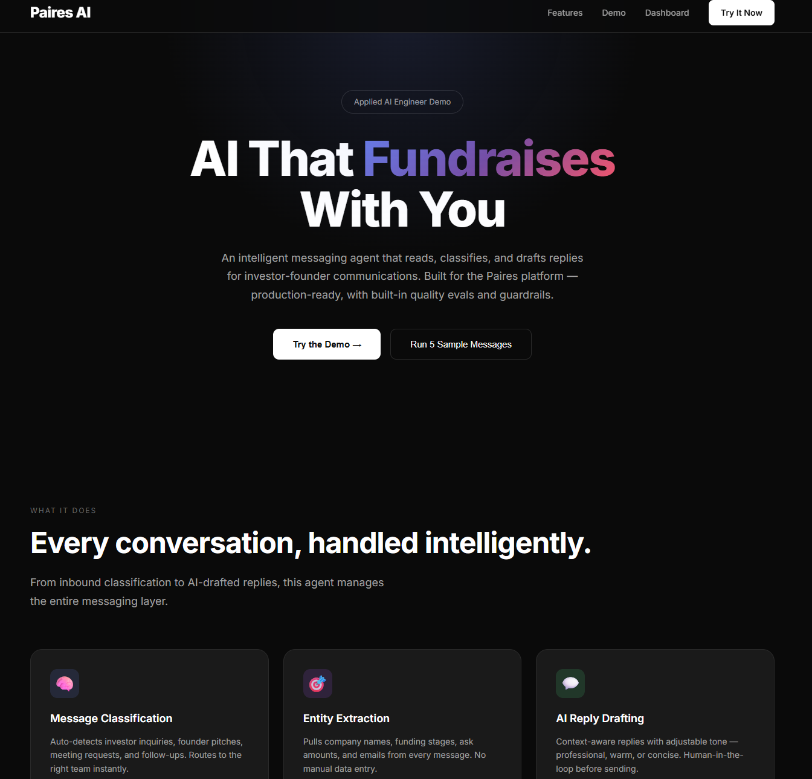

# Paires AI — Applied AI Engineer Demo

> Production-level demo of an AI-powered messaging agent for investor-founder communications. Built for the Applied AI Engineer role at [Paires](https://paires.ai).

---

## Table of Contents

1. [Overview](#overview)
2. [Architecture](#architecture)
3. [Quick Start](#quick-start)
4. [Prerequisites](#prerequisites)
5. [Backend Setup](#backend-setup)
6. [Frontend Setup](#frontend-setup)
7. [Running the Application](#running-the-application)
8. [API Reference](#api-reference)
9. [Project Structure](#project-structure)
10. [Features](#features)
11. [Testing](#testing)
12. [Tech Stack](#tech-stack)

---

## Preview



---

## Overview

Paires AI is an intelligent messaging agent that automates investor-founder communications. It reads inbound messages, classifies them by type, extracts key information, drafts context-aware replies, checks for quality and compliance, and tracks every output with a built-in evaluation framework.

### What the system does end-to-end:

```
Inbound Message → Classification → Entity Extraction → AI Drafting → Guardrails → Human Review → Metrics Logged
```

This demo maps directly to the responsibilities listed in the Applied AI Engineer job description:

| Job Requirement | Implementation |
|---|---|
| Agents that read inbound messages and draft replies | `agent/messaging_agent.py` — template + LLM hybrid |
| Messaging layer across outreach, investor network, IR | `agent/classifier.py` — 7 message types with routing |
| Classification, extraction, routing, summarization | `agent/classifier.py`, `agent/extractor.py`, `agent/summarizer.py` |
| Evals and guardrails | `evals/quality_tracker.py`, `guardrails/content_filter.py` |
| Integrate with email/CRM/messaging systems | Architecture designed for API-first integration |

---

## Architecture

```
paires-ai-demo/
├── backend/                        # FastAPI server (port 8000)
│   ├── app.py                      # Main API with 19 endpoints
│   ├── agent/
│   │   ├── __init__.py
│   │   ├── messaging_agent.py      # AI reply generation engine
│   │   ├── classifier.py           # Message type/intent classification
│   │   ├── extractor.py            # Entity extraction (NER, regex)
│   │   └── summarizer.py           # Conversation summarization
│   ├── evals/
│   │   ├── __init__.py
│   │   └── quality_tracker.py      # Quality scoring + metrics tracking
│   ├── guardrails/
│   │   ├── __init__.py
│   │   └── content_filter.py       # PII detection, compliance, tone
│   ├── data/
│   │   ├── __init__.py
│   │   └── sample_messages.py      # 5 realistic investor messages
│   └── requirements.txt
├── frontend/                       # React + Vite (port 3000)
│   ├── src/
│   │   ├── App.jsx                 # Single-page dashboard
│   │   ├── index.css               # Dark theme, Paires-inspired
│   │   └── main.jsx
│   ├── index.html
│   ├── vite.config.js              # API proxy to backend
│   └── package.json
├── tests/
│   ├── test_agent.py               # 15+ unit + integration tests
│   └── requirements.txt
└── README.md
```

### Data Flow

```
Browser (port 3000) → Vite Proxy → FastAPI (port 8000)
                                        ↓
                              ┌─────────┴─────────┐
                              │   Agent Pipeline  │
                              │  Classify → Extract│
                              │  Draft → Guardrail │
                              └─────────┬─────────┘
                                        ↓
                              Quality Tracker (metrics)
```

---

## Quick Start

The fastest way to see everything working:

```bash
git clone https://github.com/mysterious75/Paires-AI-Demo.git
cd Paires-AI-Demo/backend
pip install -r requirements.txt
python -m uvicorn app:app --reload --port 8000
```

Open **http://localhost:8000/docs** for interactive API docs.

---

## Prerequisites

### Backend

| Requirement | Version |
|---|---|
| Python | 3.9+ |
| pip | latest |

### Frontend

| Requirement | Version |
|---|---|
| Node.js | 18+ |
| npm | 9+ |

Verify:

```bash
python --version   # Should be 3.9 or higher
node --version     # Should be 18 or higher
npm --version      # Should be 9 or higher
```

---

## Backend Setup

### 1. Navigate to the backend directory

```bash
cd paires-ai-demo/backend
```

### 2. (Optional) Create a virtual environment

```bash
python -m venv venv

# Windows
venv\Scripts\activate

# macOS/Linux
source venv/bin/activate
```

### 3. Install dependencies

```bash
pip install -r requirements.txt
```

**Dependencies:**

| Package | Purpose |
|---|---|
| `fastapi` | Web framework |
| `uvicorn` | ASGI server |
| `pydantic` | Data validation |
| `openai` | LLM integration (optional, falls back to templates) |
| `httpx` | HTTP client |
| `python-dotenv` | Environment variables |

### 4. (Optional) Set up OpenAI

The agent works in **demo mode** by default using built-in templates. To enable real LLM drafting:

```bash
# Create a .env file in the backend/ directory
echo "OPENAI_API_KEY=sk-your-key-here" > .env
echo "DEMO_MODE=false" >> .env
```

When `DEMO_MODE=true` (default), the agent uses rule-based classification and template-based reply generation — no API keys required.

### 5. Start the server

```bash
uvicorn app:app --reload --host 0.0.0.0 --port 8000
```

Verify it's running:

```bash
curl http://localhost:8000/api/health
# {"status":"healthy","components":{"agent":"ready",...}}
```

### 6. Explore the API

Open **http://localhost:8000/docs** — interactive Swagger UI with all 19 endpoints documented.

---

## Frontend Setup

### 1. Navigate to the frontend directory

```bash
cd paires-ai-demo/frontend
```

### 2. Install dependencies

```bash
npm install
```

**Dependencies:**

| Package | Purpose |
|---|---|
| `react` + `react-dom` | UI framework |
| `vite` | Build tool + dev server |
| `@vitejs/plugin-react` | React support for Vite |

### 3. Start the dev server

```bash
npm run dev
```

The frontend runs on **http://localhost:3000** and proxies `/api/*` requests to the backend at port 8000.

### 4. Open the application

Navigate to **http://localhost:3000** in your browser.

---

## Running the Application

You need **both servers running simultaneously**:

| Server | Command | URL |
|---|---|---|
| Backend | `cd backend && python -m uvicorn app:app --reload` | http://localhost:8000 |
| Frontend | `cd frontend && npm run dev` | http://localhost:3000 |

### Quick test checklist:

1. Open `http://localhost:8000/docs` → Execute `POST /api/test/full-flow` → Should return 200
2. Open `http://localhost:3000` → Click "Run Complete Demo" → 5 messages processed
3. Click "Investor Inquiry" Quick Fill → Fill form → "Process & Draft Reply" → AI generates reply
4. Click ✓ Approve → Metrics update in real-time

---

## Platform-Specific Instructions

### Linux (Ubuntu/Debian)

```bash
# Install Python if not present
sudo apt update
sudo apt install python3 python3-pip python3-venv -y

# Install Node.js (for frontend)
curl -fsSL https://deb.nodesource.com/setup_18.x | sudo -E bash -
sudo apt install -y nodejs

# Clone and setup
git clone https://github.com/mysterious75/Paires-AI-Demo.git
cd Paires-AI-Demo

# Backend
cd backend
python3 -m venv venv
source venv/bin/activate
pip install -r requirements.txt
python3 -m uvicorn app:app --reload --port 8000

# Frontend (new terminal)
cd ../frontend
npm install
npm run dev
```

### macOS

```bash
# Install Python and Node via Homebrew
brew install python node

# Clone and setup
git clone https://github.com/mysterious75/Paires-AI-Demo.git
cd Paires-AI-Demo

# Backend
cd backend
python3 -m venv venv
source venv/bin/activate
pip3 install -r requirements.txt
python3 -m uvicorn app:app --reload --port 8000

# Frontend (new terminal)
cd ../frontend
npm install
npm run dev
```

### Windows

```powershell
# Install Python from https://python.org (check "Add to PATH")
# Install Node.js from https://nodejs.org

# Clone and setup
git clone https://github.com/mysterious75/Paires-AI-Demo.git
cd Paires-AI-Demo

# Backend
cd backend
python -m venv venv
venv\Scripts\activate
pip install -r requirements.txt
python -m uvicorn app:app --reload --port 8000

# Frontend (new terminal)
cd ..\frontend
npm install
npm run dev
```

---

## Troubleshooting

### "No module named 'fastapi'"
```bash
pip install -r requirements.txt
```

### "Port 8000 already in use"
```bash
# Linux/macOS:
lsof -ti:8000 | xargs kill -9

# Windows:
netstat -ano | findstr :8000
taskkill /PID <PID> /F
```

### "npm not found"
```bash
# Install Node.js from https://nodejs.org
# Then restart terminal
```

### Frontend shows blank page
```bash
cd frontend
rm -rf node_modules
npm install
npm run dev
```

### OpenAI API key errors
The agent works in **demo mode** by default — no API key needed. If you see OpenAI errors, make sure `DEMO_MODE=true` in your `.env` file.

---

## API Reference

Full interactive documentation at `http://localhost:8000/docs`.

### Core Endpoints

| Method | Endpoint | Description |
|---|---|---|
| `POST` | `/api/messages/inbound` | Process an incoming message (classify + extract + route) |
| `POST` | `/api/drafts/generate` | Generate an AI-drafted reply |
| `POST` | `/api/drafts/{id}/approve` | Approve or reject a draft (human-in-the-loop) |
| `POST` | `/api/messages/batch` | Process multiple messages at once |
| `POST` | `/api/demo/run` | Run complete demo with 5 sample messages |

### Quality & Metrics

| Method | Endpoint | Description |
|---|---|---|
| `GET` | `/api/evals/dashboard` | Quality metrics dashboard |
| `GET` | `/api/evals/recent` | Recent draft evaluations |
| `GET` | `/api/evals/accuracy` | Classification + extraction accuracy |
| `GET` | `/api/analytics/volume` | Message volume by type + hour |
| `GET` | `/api/analytics/performance` | Agent performance metrics |

### Conversations

| Method | Endpoint | Description |
|---|---|---|
| `GET` | `/api/conversations` | List all conversation threads |
| `GET` | `/api/conversations/summary` | Get AI summary of latest thread |

### Easy Test (One-Click)

| Method | Endpoint | Description |
|---|---|---|
| `POST` | `/api/test/full-flow` | Create message + draft + approve in one call |
| `POST` | `/api/test/create-and-draft` | Create message and generate draft |
| `POST` | `/api/test/approve-latest` | Auto-approve the most recent draft |

### System

| Method | Endpoint | Description |
|---|---|---|
| `GET` | `/api/health` | Health check for all components |
| `GET` | `/` | Welcome page |

---

## Features

### 1. Message Classification
Auto-detects message type from 7 categories:

- **Investor Inquiry** — Investor asking about platform, deals, opportunities
- **Founder Pitch** — Founder seeking investment or platform services
- **Follow-up** — Continuation of existing conversation
- **Meeting Request** — Request to schedule a meeting
- **General Inquiry** — General questions
- **Partnership** — Business development proposals
- **Support** — Technical issues

Each message also gets urgency level (high/medium/low) and sentiment analysis (positive/neutral/negative).

### 2. Entity Extraction
Extracts structured data from unstructured text:

- Email addresses, phone numbers, URLs
- Monetary amounts (e.g., `$8,000,000`)
- Dates, percentages
- Company names from signatures
- Sender names from greetings
- Funding stages (Pre-seed through IPO)
- Ask amounts for fundraising rounds
- Key topics (fundraising, technology, partnership, etc.)

### 3. AI Reply Drafting
Generates context-aware replies with adjustable tone:

- **Professional** — Formal business communication
- **Warm** — Friendly but professional
- **Concise** — Brief and to-the-point
- **Detailed** — Thorough, addresses all points
- **Follow-up** — Gentle reminder tone

Templates are tailored per message type. In non-demo mode, uses OpenAI GPT-4 for dynamic generation.

### 4. Guardrails System
Every draft passes through 5 checks before delivery:

| Check | Weight | What It Does |
|---|---|---|
| PII Detection | 40% | Detects SSNs, credit cards, phone numbers |
| Inappropriate Content | 25% | Filters spam, scam language |
| Compliance | 25% | Blocks guaranteed returns, pressure tactics |
| Length Validation | 5% | Enforces 20-300 word range |
| Tone Analysis | 5% | Flags casual/aggressive language |

Returns a **risk score** (0-1) with risk level (low/medium/high/critical).

### 5. Quality Metrics
Every draft is scored on 5 dimensions:

| Dimension | Weight | Description |
|---|---|---|
| Relevance | 30% | How well the draft addresses the original message |
| Completeness | 25% | Whether all necessary aspects are covered |
| Tone Appropriateness | 20% | Appropriate formality and business etiquette |
| Professionalism | 15% | Proper greetings, closings, and structure |
| Conciseness | 10% | Optimal length (50-150 words ideal) |

All scores tracked over time in the evals dashboard.

### 6. Human-in-the-Loop
Every draft requires human review before sending:

- **Approve** — Send as-is
- **Edit & Approve** — Make changes, then send
- **Reject** — Provide feedback to improve future drafts

Approval/edits tracked for continuous improvement.

### 7. Batch Processing
Process up to 100 messages in a single API call for bulk imports or initial setup.

### 8. Conversation Summarization
AI-generated summaries of any conversation thread, including key points, action items, and recommended next steps.

---

## Testing

### Run the test suite

```bash
cd paires-ai-demo/tests
pip install -r requirements.txt
pytest test_agent.py -v
```

### Test coverage

| Test Class | Tests | What It Covers |
|---|---|---|
| `TestClassifier` | 6 tests | All classification types, urgency, routing |
| `TestExtractor` | 6 tests | Email, money, company, funding stage, topics, confidence |
| `TestContentFilter` | 6 tests | PII, inappropriate, compliance, length, professional, risk |
| `TestQualityTracker` | 4 tests | Scoring, dashboard, accuracy, approval rate |
| `TestEndToEnd` | 2 tests | Complete pipeline, full demo flow |

### API testing

All 19 endpoints are individually callable from `http://localhost:8000/docs` with the Swagger UI. One-click test endpoints require no input.

---

## Tech Stack

| Layer | Technology |
|---|---|
| **Backend Framework** | FastAPI (Python) |
| **AI/LLM** | OpenAI GPT-4 (optional), template-based fallback |
| **Classification** | Rule-based hybrid with keyword scoring |
| **Entity Extraction** | Regex patterns + heuristic rules |
| **Frontend** | React 18 + Vite 5 |
| **Styling** | Custom CSS with CSS variables (dark theme) |
| **API Documentation** | Swagger UI (auto-generated) |
| **Testing** | pytest + pytest-asyncio |
| **Proxy** | Vite dev server proxy |

---

## Design Decisions

- **No database** — In-memory storage for demo simplicity. Designed for easy swap to PostgreSQL/Redis.
- **Hybrid approach** — Templates for demo mode, LLM for production. No API key needed to run.
- **Auto-fallback** — All endpoints have graceful degradation. If a specific ID isn't found, uses the latest available.
- **One-click testing** — `/api/test/*` endpoints require zero input, making the system immediately demonstrable.
- **Quality-first** — Every output scored, every draft checked. Metrics trackable over time through the dashboard.

---

Built for the **Paires Applied AI Engineer** role.
